> **РОССИЙСКИЙ** **УНИВЕРСИТЕТ** **ДРУЖБЫ** **НАРОДОВ** **Факультет**
> **физико-математических** **и** **естественных** **наук**
>
> **Кафедра** **прикладной** **информатики** **и** **теории**
> **вероятностей**
>
> **ОТЧЕТ** **ПО** **ЛАБОРАТОРНОЙ** **РАБОТЕ** **№2**
>
>
> *<u>Дисциплина: Архитектура компьютера</u>*
>
> <u>Студент: Диденко Герман Максимович</u>
>
> Студ. Билет: № 1032253558 Группа: НКАбд-02-25
>
> **МОСКВА** 2025 г.

**1.** **Цель** **работы**

Целью работы является изучение идеологии и применения средств контроля
версий, приобретение практических навыков по работе с системой контроля
версий git

**2.** **Задание**

На основе методических указаний провести работу с базовыми командами
системы контроля версий git, настроить GitHub, выучить применение команд
для разных случаев использования в git.

**3.** **Выполнение** **лабораторной** **работы**

**3.1.** **Настройка** **github**

Я открыл сайт [<u>github.com</u>](https://github.com), ввел свои данные
и прошел регистрацию, после чего попал на главное окно
github.com/dashboard

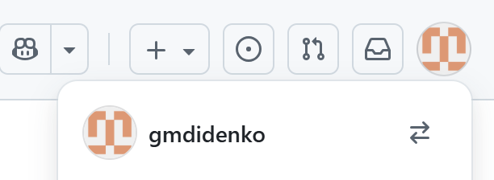
> Рис. 1 Созданная учетная запись в GitHub

**3.2.** **Базовая** **настройка** **git**

Я сделаю предварительную конфигурацию git. Открою терминал и введу
следующие команды, указав своё имя и e-mail

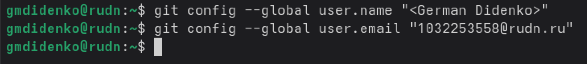
> Рис. 2 Настройка имени и email в git

Также я настрою utf-8 в выводе сообщений git

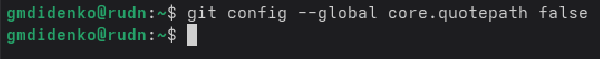
> Рис. 3 Настройка utf-8 в git

Задам имя начальной ветки (master)

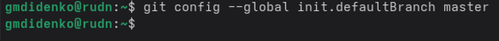
> Рис. 4 Заданное имя метки

Также задам параметр autocrlf

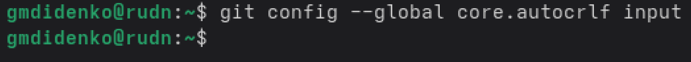
> Рис. 5 Параметр autocrlf

А также safecrlf

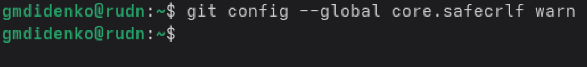
> Рис. 6 Параметр safecrlf

**3.3.** **Создание** **SSH-ключа**

Теперь я сгенерирую пару ключей (приватный и открытый) на сервере

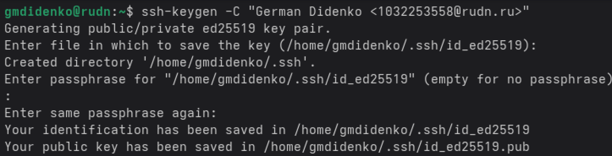
> Рис. 7 Сгенерированные ключи

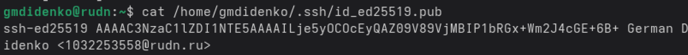
> Рис. 7.1 Содержимое ключа

Сгенерированный ключ я копирую и вставляю его на GitHub

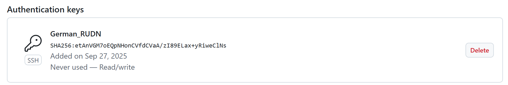
> Рис. 8 Ключ добавлен в GitHub

Получаем ключ, готовый к использованию с GitHub

**3.4.** **Создание** **рабочего** **пространства** **и**
**репозитория** **курса** **на** **основе** **шаблона**

Для дальнейшей работы с лабораторными работы, создаем каталог для
предмета «Архитектура компьютера»

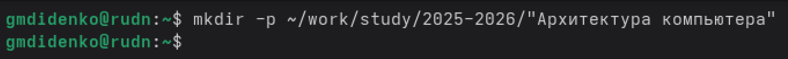
> Рис. 9 Созданный каталог «Архитектура компьютера»

Затем идем на GitHub yamadharma и копируем репозиторий. Называем его
study_2025–2026_arh-pc

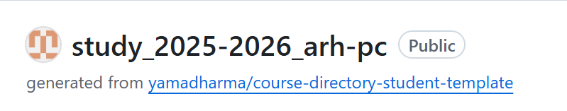
> Рис. 10 Созданный репозиторий

Открываю папку ~/work/study/2025-2026/"Архитектура компьютера"/arch-pc и
клонирую репозиторий в нее

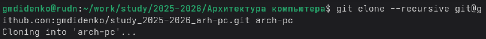
> Рис. 11 Клонируем репозиторий (git clone)

**3.5.** **Настройка** **каталога** **курса**

Теперь я перехожу в каталог arch-pc и создаю необходимые каталоги

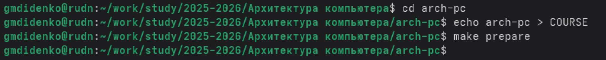
> Рис. 10 Папка parentdir, созданная в домашнем каталоге.

Отправляю файлы на сервер

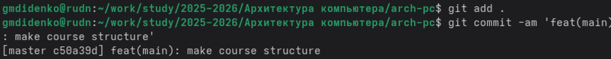
> Рис. 11 Команды git add, git commit

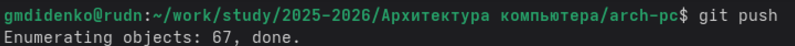
> Рис. 12 Команда git push

Захожу на GitHub и проверяю иерархию рабочего пространства

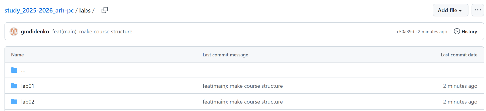
> Рис. 13 Папка labs на GitHub

Теперь проверим labs через консоль

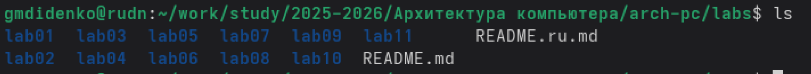
> Рис. 14 Папка labs в консоли

Выводы в папке labs совпадают.

**4.** **Задания** **для** **самостоятельной** **работы**

**Задание** **1.**

Захожу на GitHub, выбираю папку labs/lab01/report и загружаю в нее
предыдущую лабораторную работу.

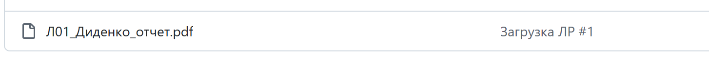
> Рис. 15 Загруженная лабораторная работа на GitHub

**5.** **Вывод**

В ходе выполнения лабораторной работы были освоены навыки работы с
github.com. Были созданы ssh-ключи для последующей работе с git. Были
опробованы команды git add, git commit, а также git push.

**6.** **Список** **литературы**

1\) Основные команды git:

[<u>https://git-scm.com/book/ru/v2/Приложение-C:-Команды-Git-Основные-команды</u>](https://git-scm.com/book/ru/v2/%D0%9F%D1%80%D0%B8%D0%BB%D0%BE%D0%B6%D0%B5%D0%BD%D0%B8%D0%B5-C:-%D0%9A%D0%BE%D0%BC%D0%B0%D0%BD%D0%B4%D1%8B-Git-%D0%9E%D1%81%D0%BD%D0%BE%D0%B2%D0%BD%D1%8B%D0%B5-%D0%BA%D0%BE%D0%BC%D0%B0%D0%BD%D0%B4%D1%8B)

2\) Создание репозитория:

[<u>https://docs.github.com/ru/repositories/creating-and-managingrepositories/creating-a-new-repository</u>](https://docs.github.com/ru/repositories/creating-and-managingrepositories/creating-a-new-repository)

2\) Настройка git и создание SSH-ключа для него:
[<u>https://htmlacademy.ru/blog/git/git-console</u>](https://htmlacademy.ru/blog/git/git-console)
